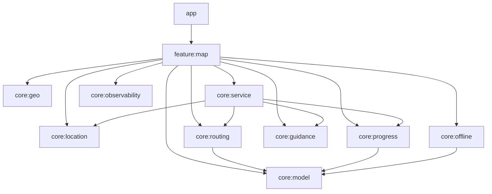
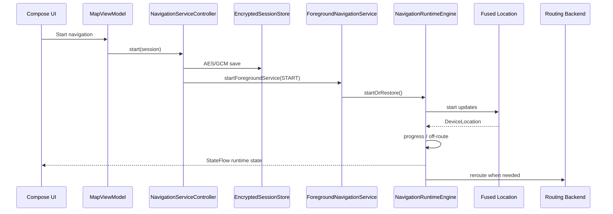
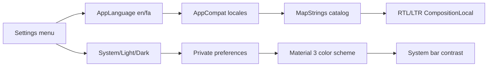

# معماری Professional Map Pro

## دامنه پروژه

این مخزن یک اپلیکیشن native Android چندماژوله با Jetpack Compose است. تمام ماژول‌ها برای اجرای
اپ Android، کتابخانه‌های Android یا منطق Kotlin/JVM مورد استفاده همان اپ تعریف شده‌اند. تنها target
قابل اجرا و انتشار پروژه Android است.

## نمای کلی

`feature:map` composition root adapterهای Android را می‌سازد. ViewModel قراردادها را دریافت می‌کند
و به implementation شبکه، GPS یا Firebase وابسته مستقیم نیست.

## ماژول‌ها

### `app`

Application، Activity، theme، manifest، signing، versioning و Firebase اختیاری را نگه می‌دارد.
Telemetry پیش‌فرض خاموش است و pluginهای Firebase بدون config واقعی resolve نمی‌شوند.

### `feature:map`

Compose UI، `MapUiState`، controllerهای presentation، use caseها، localization و اتصال dependencyها
را شامل می‌شود. UI فقط state را نمایش می‌دهد و command می‌فرستد؛ محاسبه background navigation
داخل ViewModel انجام نمی‌شود.

### `core:service`

مالک runtime ناوبری است:

- دریافت GPS و نگهداری wake lock محدود
- محاسبه progress، completed/remaining geometry و arrival
- تشخیص off-route و reroute
- foreground notification و pause/resume/stop
- ارزیابی اعلان‌های راهنما و Text-to-Speech مستقل از Activity/ViewModel
- restore session بعد از نابودی Activity/process

`NavigationSession` قبل از شروع service با AES/GCM و کلید Android Keystore در
`noBackupFilesDir` ذخیره می‌شود. موقعیت زنده کاربر persist نمی‌شود. UI از
`NavigationRuntimeRegistry.state` مشاهده می‌کند و با نابودی ViewModel سرویس متوقف نمی‌شود.

## مرز حریم خصوصی

`core:routing` خطاها را به `RoutingErrorCode` تبدیل می‌کند و متن خام Ktor/OSRM را بیرون نمی‌دهد.
`PrivacySanitizer` آخرین مرز پیش از Firebase است و URL، coordinate pair، bearer token و keyهای
متداول را حذف می‌کند. UI نیز detail خارجی را نمایش نمی‌دهد. شناسه route با fingerprint ساخته
می‌شود و مختصات ابتدا/انتها در آن قرار نمی‌گیرند.

## زبان، RTL و theme

`MainActivity` مالک تنظیمات سطح اپ است. زبان با `AppCompatDelegate.setApplicationLocales` تغییر می‌کند
و فقط localeهای `en` و `fa` در `locales_config.xml` اعلام شده‌اند. `MapScreen` locale فعال را به
`AppLanguage` تبدیل می‌کند، catalog تایپ‌شده `MapStrings` را انتخاب می‌کند و با `MapTextDirection`
جهت Compose را برای فارسی RTL و برای انگلیسی LTR قرار می‌دهد. متن‌های فنی مانند شناسه route با
نشانه‌های bidi ایمن نگه داشته می‌شوند تا در متن فارسی وارونه نشوند.

تم سه حالت `System`، `Light` و `Dark` دارد. انتخاب کاربر در `AppAppearancePreferences` ذخیره می‌شود و
`ProfessionalMapApplication` پیش از ساخت اولین Activity حالت night را اعمال می‌کند. رنگ‌بندی‌های روشن
و تاریک به‌صورت کامل در Material 3 تعریف شده‌اند؛ وضعیت iconهای status/navigation bar نیز با theme
هماهنگ می‌شود. style تاریک MapLibre یک انتخاب مستقل است تا تغییر theme، style انتخابی کاربر یا منطق
نقشه را ناخواسته بازنویسی نکند.

## State management

- state صفحه با `StateFlow<MapUiState>` منتشر می‌شود.
- controllerها مسئول location، route، navigation، guidance و offline هستند.
- coroutineهای UI در `viewModelScope` و runtime سرویس در scope خود سرویس اجرا می‌شوند.
- cancellation برای route calculation، worker و reroute حفظ می‌شود.
- eventهای قابل نمایش به‌صورت `MapUiMessage` typed هستند.

## Rendering و lifecycle نقشه

`MapLibreView` lifecycleهای start/resume/pause/stop/destroy، saved state و low-memory را منتقل
می‌کند. `rememberMapScene` داده‌های map-relevant را memoize می‌کند تا تغییرهای نامرتبط UI باعث بازسازی
POIها، geometry مسیر یا maneuverها نشوند. `MapLibreView` آخرین scene را با `snapshotFlow` جمع‌آوری می‌کند؛
بنابراین coroutine رندر برای هر تغییر state لغو و دوباره ساخته نمی‌شود. `MapSceneRenderer` sourceها را فقط
هنگام تغییر واقعی GeoJSON به‌روزرسانی می‌کند، layerهای هر style را یک بار آماده می‌سازد و style failure را
به UI می‌فرستد تا retry قابل مشاهده باشد. route identity فقط fingerprint است.

### معماری markerها

- POIها داخل یک `GeoJsonSource` خوشه‌بندی‌شده قرار می‌گیرند؛ برای هر marker یک Android View ساخته نمی‌شود.
- category، title، subtitle و symbol به‌صورت feature property وارد style می‌شوند و layerها فقط مسئول رندرند.
- clusterها برای بازه‌های کوچک، متوسط و بزرگ ظاهر جدا دارند و با `getClusterExpansionZoom` باز می‌شوند.
- hit testing ترتیب مشخص دارد: cluster، POI، route alternative و در آخر نقطه عمومی نقشه.
- marker انتخاب‌شده source مستقل، halo، core، symbol و label پرکنتراست دارد تا selection بدون بازسازی کل POI source دیده شود.
- مبدا و مقصد رنگ مستقل دارند؛ مانورها، موقعیت خام، موقعیت snapped، instruction point و heading نیز هرکدام source/layer مستقل دارند.
- `MapManeuverMarkerReducer` نقاط بسیار نزدیک به endpoint یا یکدیگر را حذف می‌کند تا مسیر شلوغ نشود.
- source cache از `setGeoJson` غیرضروری جلوگیری می‌کند؛ route selection و endpointها با کلید مستقل بررسی می‌شوند تا هر fix GPS باعث ساخت Pair/List موقت نشود. sourceهای پویا به‌صورت async به‌روز می‌شوند تا UI thread برای serialize/update منتظر نماند.

### معماری UI و performance

- پالت روشن و تاریک، shapeها، spacing، elevation و toneهای وضعیت در design system مشترک نگهداری می‌شوند.
- `MapControlPanel` یک `LazyColumn` کلیددار است تا sectionهای خارج از viewport در اولین نمایش compose نشوند.
- در compact mode، `MapNavigationCockpitOverlay` دستور بعدی، فاصله، زمان و progress را جایگزین HUD عمومی می‌کند؛ تغییرهای پویا با animation کوتاه و semantics زنده برای accessibility منتشر می‌شوند.
- dock پایین فقط primitive stateهای موردنیاز را دریافت می‌کند و callbackهای منو/تعامل نقشه memoize شده‌اند تا updateهای GPS باعث recomposition غیرضروری کنترل‌های ثابت نشوند.
- `MapScene` و `MapActionHandlers` قرارداد پایداری Compose دارند و selected route از قبل در scene قرار می‌گیرد؛ camera update دیگر route alternatives را scan نمی‌کند.
- `MapSceneFactory` ترجمه POIها و geometry مشتق‌شده را فقط با تغییر dependencyهای واقعی دوباره محاسبه می‌کند.
- `MapSceneRenderer` source update را از layer construction جدا می‌کند؛ layerها با تغییر frame دوباره ساخته نمی‌شوند.
- labelهای POI در zoom پایین پنهان می‌مانند تا clutter و هزینه glyph placement کنترل شود.
- دوربین navigation بین updateهای نزدیک حداقل فاصله زمانی دارد و محاسبه look-ahead بدون allocationهای موقت لیست انجام می‌شود.
- مسیرهای مهم startup و rendering در `app/src/main/baseline-prof.txt` ثبت شده‌اند و با ماژول `benchmark` قابل اندازه‌گیری‌اند.

### دوربین ناوبری

`MapCameraController` هنگام مشاهده route، فقط مسیر انتخاب‌شده را fit می‌کند. در navigation mode هدف دوربین
یک نقطه look-ahead روی بخش باقی‌مانده مسیر است، bearing با heading دستگاه یا جهت segment محاسبه و نرم
می‌شود، zoom با سرعت تغییر می‌کند و tilt برای خوانایی مسیر جلوتر اعمال می‌شود. در حالت عادی انتخاب route
جدید با identity جدید فقط یک بار camera fit ایجاد می‌کند.

## Routing و map matching

`RoutingRepository` قرارداد provider-neutral است. `OsrmRoutingRepository` adapter فعلی است و
HttpClient Android به‌صورت صریح ساخته می‌شود. `CachedRoutingRepository` دارای TTL monotonic، LRU
محدود و coalescing درخواست‌های همسان است. release build endpoint عمومی را نمی‌پذیرد.

`RouteSnapOptions` hintهای provider-neutral برای bearing، tolerance، radius و `continueStraight` را حمل
می‌کند. adapter OSRM آرایه‌های `bearings` و `radiuses` را با تعداد waypoint یکسان encode می‌کند. درخواست
اولیه و reroute از bearing و accuracy واقعی GPS برای کاهش snap روی خیابان یا جهت اشتباه استفاده می‌کنند.

`ProjectionRouteMatcher` چند candidate نزدیک تولید می‌کند و `RouteMatchSelector` آن‌ها را با فاصله، اختلاف
heading و continuity امتیاز می‌دهد. آستانه off-route با accuracy GPS بزرگ می‌شود اما سقف ایمنی دارد.
`NavigationReroutePolicy` یک fix نویزی را کافی نمی‌داند؛ شواهد متوالی، debounce و cooldown درخواست‌های
تکراری را کنترل می‌کنند. route recovery و موفقیت reroute state سیاست را reset می‌کنند.

## Offline

WorkManager دانلودها را persist می‌کند. پیش از enqueue، bounds دقیق، Style URL، عنوان و تنظیمات
دانلود در یک payload باینری قرار می‌گیرند و با AES/GCM و کلید Android Keystore رمز می‌شوند؛ در
WorkManager Data فقط ciphertext و یک شناسه fingerprintشده باقی می‌ماند. وضعیت queue از LiveData
callback مشاهده می‌شود و polling یک‌ثانیه‌ای وجود ندارد. workهای replaced/stale و finished دوباره
پردازش نمی‌شوند.

## Observability

`AppMonitor` abstraction مشترک است. `DisabledAppMonitor` رفتار پیش‌فرض امن را فراهم می‌کند.
Firebase فقط با config و opt-in build فعال می‌شود. Firebase Performance عمداً حذف شده است تا
instrumentation خودکار شبکه نتواند URL مسیرهای حاوی مختصات را ثبت کند؛ زمان‌سنجی‌ها به eventهای
سفارشی بدون URL تبدیل می‌شوند. شناسه کاربر قبل از ارسال pseudonymize می‌شود. geo engine انتخاب‌شده
به‌صورت code امن گزارش می‌شود و fallback بومی به Kotlin دیگر silent نیست.

## Security و release

- cleartext در manifest release غیرفعال است
- backup غیرفعال است
- release signing اجباری و fail-closed است
- R8 و resource shrinking فعال‌اند
- endpoint routing باید HTTPS و production باشد
- فایل‌های LICENSE/NOTICE dependencyها عمداً از package حذف نمی‌شوند
- CI علاوه بر debug/test/lint، AAB release امضاشده با کلید موقت را build می‌کند

## Testing strategy

ماژول `benchmark` یک `com.android.test` مستقل است و به variant نزدیک به release اپ وصل می‌شود. `StartupBenchmark` startup/frame timing را با `CompilationMode.None` و Baseline Profile مقایسه می‌کند. `BaselineProfileGenerator` نیز مسیر cold start را برای بازتولید profile ثبت می‌کند. به دلیل ناسازگاری نسخه پایدار Baseline Profile Gradle Plugin با DSL جدید AGP 9، اتصال خودکار plugin وارد build production نشده و پروفایل commit‌شده پس از اجرای generator و بازبینی دستی به‌روزرسانی می‌شود.

- unit test برای مدل، geo، routing، progress، guidance، offline، service و presentation
- تست مسیرهای موازی، heading-aware matching، accuracy تطبیقی، encoding پارامترهای OSRM و cooldown reroute
- تست کاهش تراکم maneuver marker، localization marker و یکتایی source/layer IDهای MapLibre
- privacy sanitizer test برای URL/coordinate/token
- instrumentation smoke test برای Activity
- instrumentation test برای encrypted session و نبود plaintext coordinate روی disk
- instrumentation test برای ciphertext ورودی WorkManager و نبود bounds، token یا Style URL خام
- baseline profile دستی اولیه در `app/src/main/baseline-prof.txt`

پیش از انتشار عمومی، benchmark و baseline profile باید روی سخت‌افزار نماینده دوباره تولید شوند و
UI/accessibility tests روی Emulator و دستگاه واقعی در pipeline اجرا شوند.

## تصمیم‌های آگاهانه

- اپ تک‌صفحه است؛ اضافه‌کردن Navigation Compose فقط برای داشتن یک graph صوری ارزش ندارد. با اضافه
  شدن destination دوم، routeهای type-safe و graph مستقل باید اضافه شوند.
- foreground service نمی‌تواند Force stop کاربر را دور بزند.
- backend routing و tile provider بخشی از معماری عملیاتی‌اند و SLA آن‌ها خارج از APK است.
