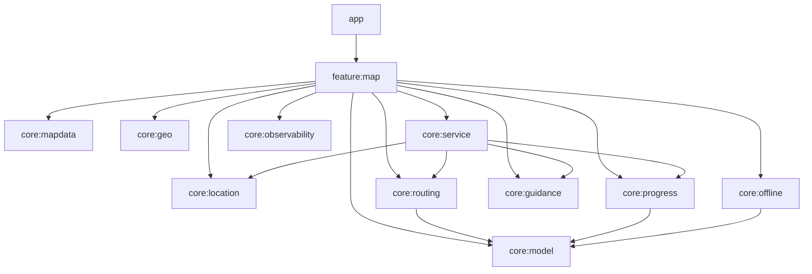
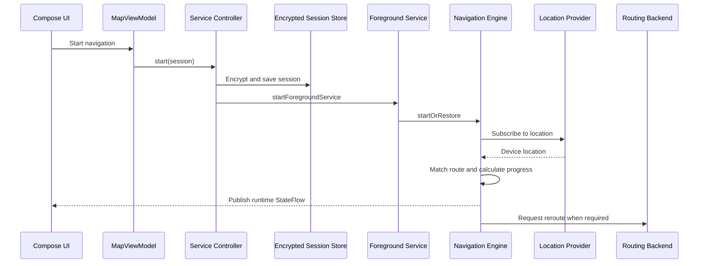

<div align="center">

# Professional Map Pro

### Production-oriented Android maps, routing and background navigation

Professional Map Pro is a native Android application built with Kotlin,  
Jetpack Compose and MapLibre for live location, route planning, turn guidance,  
background navigation and offline-region workflows.

[](https://github.com/ALISCHILLER/Professional-Map-Pro-Compose/actions/workflows/android.yml)
[](https://developer.android.com/)
[](https://kotlinlang.org/)
[](https://developer.android.com/compose)
[](https://maplibre.org/)
[](https://developer.android.com/about/versions/oreo)
[](LICENSE.md)

[Features](#features) •
[Architecture](#architecture) •
[Getting Started](#getting-started) •
[Configuration](#configuration) •
[Testing](#testing-and-quality-gates) •
[Security](#security-and-privacy)

</div>

---

## Overview

**Professional Map Pro** is an Android-only mapping and navigation application designed around clear module boundaries, long-running navigation outside the UI lifecycle and privacy-aware observability.

The project separates map presentation, routing, progress calculation, voice guidance, offline operations, location collection and navigation runtime into dedicated modules. Jetpack Compose renders the application UI, while MapLibre Native renders the map and GeoJSON layers.

> This repository targets native Android only.  
> It is not a Kotlin Multiplatform or Compose Multiplatform project.

---

## Features

### Maps and points of interest

- MapLibre-based map rendering
- Multiple configurable map styles
- Independent light and dark map styles
- Categorized POI markers
- Marker labels, colors and symbols
- GeoJSON-based marker rendering
- Marker clustering and cluster expansion
- Touch selection with a dedicated high-contrast selection layer
- POI detail cards
- Direct route creation from a selected POI
- Separate layers for origin, destination, maneuvers and live position

### Routing

- OSRM-compatible routing backend
- Route calculation between selected points
- Alternative route support
- Alternative route selection directly from the map
- Selected-route fingerprinting
- Route geometry separation for completed and remaining segments
- Bearing- and accuracy-aware route snapping
- Typed routing errors instead of exposing raw network messages

### Background navigation

- Navigation runtime owned by a foreground service
- Navigation independent from the Activity and ViewModel lifecycle
- Pause, resume and stop operations
- Adaptive progress calculation
- Arrival detection
- Off-route detection
- Debounced and cooldown-aware rerouting
- Wake-lock usage limited to navigation runtime
- Session restoration after Activity or process recreation
- Foreground notification support
- Voice guidance and Text-to-Speech outside the UI lifecycle

### Navigation experience

- Raw and snapped location visualization
- Maneuver markers
- Route progress and remaining distance
- Next-instruction cockpit
- Speed-aware camera zoom
- Route-aware bearing and tilt
- Camera look-ahead on the remaining route
- Independent follow-location control
- Stable camera updates with minimum update intervals

### Offline workflows

- Offline-region download and management
- WorkManager-based background processing
- Encrypted offline job payloads
- No one-second polling loop
- Explicit provider and production-attribution requirements

### Localization and appearance

- English and Persian
- Complete LTR and RTL switching
- Safe rendering of technical identifiers inside RTL text
- System, light and dark application themes
- Independent map-style selection
- Persisted language and appearance preferences
- Voice-language synchronization with independent override support
- Adaptive layouts and font-scale support

### Accessibility

- Semantic states for active, warning and error conditions
- Live navigation instruction announcements
- High-contrast selected-marker presentation
- Accessible navigation controls
- Adaptive control layout
- Large-font support
- Clear disabled and retry states

### Performance

- Memoized map scenes
- Stable Compose models and handlers
- Differential GeoJSON updates
- Source-level update caching
- Map layer reuse
- Asynchronous dynamic-source updates
- Keyed lazy control panels
- Reduced GPS-driven recompositions
- Allocation-aware route and camera processing
- Baseline Profile support
- Macrobenchmark module for startup measurements

---

## Tech Stack

| Area | Technologies |
|---|---|
| Language | Kotlin `2.4.0` |
| UI | Jetpack Compose, Material 3 |
| Maps | MapLibre Native `13.3.0`, GeoJSON |
| State | StateFlow, Coroutines |
| Networking | Ktor Client, Kotlin Serialization |
| Location | Google Play services Location |
| Background work | Foreground Service, WorkManager |
| Security | Android Keystore, AES/GCM |
| Localization | AppCompat application locales, typed string catalog |
| Observability | Optional Firebase Analytics and Crashlytics |
| Performance | Baseline Profiles, Macrobenchmark, LeakCanary |
| Build | Gradle `9.5.1`, AGP `9.0.1`, Java 17 bytecode |

---

## Architecture

The application is split into focused Android and Kotlin/JVM modules.



### Module responsibilities

| Module | Responsibility |
|---|---|
| `:app` | Application entry point, Activity, theme, release configuration and optional Firebase setup |
| `:feature:map` | Compose UI, `MapUiState`, presentation controllers, localization and dependency composition |
| `:core:model` | Shared domain models |
| `:core:mapdata` | Map-facing data contracts and transformations |
| `:core:geo` | Geometry and geographic helpers |
| `:core:location` | Location contracts and Android location implementation |
| `:core:routing` | Routing contracts, OSRM adapter and typed errors |
| `:core:progress` | Route matching, progress and arrival calculation |
| `:core:guidance` | Maneuver and voice-guidance logic |
| `:core:offline` | Offline-region persistence and WorkManager operations |
| `:core:service` | Foreground navigation runtime and encrypted session restoration |
| `:core:observability` | Telemetry boundary and sensitive-data sanitization |
| `:benchmark` | Macrobenchmark and Baseline Profile generation |

The UI displays state and sends commands. Long-running navigation calculations do not belong to the Activity or `MapViewModel`; they are owned by the foreground navigation runtime.

See [ARCHITECTURE.md](ARCHITECTURE.md) for detailed diagrams, module rules and implementation decisions.

---

## Navigation Runtime

Navigation begins by storing the required session securely, then starting the foreground service.



Live user location is not persisted as part of the navigation session. The UI observes runtime state and can be recreated without stopping active navigation.

---

## Requirements

| Requirement | Version |
|---|---:|
| Android Studio | Recent stable version |
| JDK | `17` or `21` |
| Android Compile SDK | `36` |
| Android Target SDK | `36` |
| Android Min SDK | `26` |
| Android NDK | `28.2.13676358` |
| CMake | `3.22.1` |
| Gradle Wrapper | `9.5.1` |
| Android Gradle Plugin | `9.0.1` |

The Gradle Wrapper is committed and checksum-pinned. A separate system Gradle installation is not required.

---

## Getting Started

### Clone

```bash
git clone https://github.com/ALISCHILLER/Professional-Map-Pro-Compose.git
cd Professional-Map-Pro-Compose
```

Create `local.properties` from the example:

```bash
cp local.properties.example local.properties
```

On Windows PowerShell:

```powershell
Copy-Item local.properties.example local.properties
```

Set the local Android SDK path:

```properties
sdk.dir=C\:\\Users\\YOUR_USER\\AppData\\Local\\Android\\Sdk
```

On Linux or macOS:

```properties
sdk.dir=/home/YOUR_USER/Android/Sdk
```

### Verify the environment

```bash
./scripts/verify-build-environment.sh
./scripts/verify-static.sh
./scripts/verify-test-suite.sh
```

### Build and install the debug application

```bash
./gradlew :app:assembleDebug
./gradlew :app:installDebug
```

On Windows:

```powershell
.\gradlew.bat :app:assembleDebug
.\gradlew.bat :app:installDebug
```

The debug APK is generated at:

```text
app/build/outputs/apk/debug/app-debug.apk
```

---

## Configuration

### Development routing

Configure routing through a local, uncommitted Gradle properties file or environment variables:

```properties
PMP_OSRM_BASE_URL=https://router.project-osrm.org
PMP_ROUTING_USER_AGENT=ProfessionalMapPro-Dev/1.0 (developer@example.com)
```

The public OSRM endpoint is suitable only for local development and testing. Routing requests contain coordinates.

For production, configure a controlled HTTPS routing service with:

- Rate limiting
- Access control
- Monitoring
- A documented retention policy
- Safe logging rules
- Capacity appropriate for the expected traffic

### Release configuration

Release builds require explicit configuration:

| Variable | Purpose |
|---|---|
| `PMP_OSRM_BASE_URL` | Production routing service URL |
| `PMP_ROUTING_USER_AGENT` | Client identification and support contact |
| `PMP_RELEASE_STORE_FILE` | Release keystore path |
| `PMP_RELEASE_STORE_PASSWORD` | Keystore password |
| `PMP_RELEASE_KEY_ALIAS` | Release key alias |
| `PMP_RELEASE_KEY_PASSWORD` | Release key password |
| `PMP_VERSION_CODE` | Positive Android version code |
| `PMP_VERSION_NAME` | Release version name |
| `PMP_TELEMETRY_DEFAULT_ENABLED` | Explicit telemetry default; otherwise `false` |

Release builds reject missing signing or version configuration. Do not commit signing files, passwords or production routing credentials.

### Optional Firebase configuration

Firebase is disabled when this file is absent:

```text
app/google-services.json
```

To enable Firebase:

1. Register the Android application with the correct application ID.
2. Place the real `google-services.json` in `app/`.
3. Keep the file outside version control.
4. Re-sync Gradle.

```bash
./gradlew --stop
./gradlew :app:assembleDebug --refresh-dependencies
```

Firebase plugins are applied only when the real configuration file exists.

---

## Security and Privacy

The project applies several privacy and release-hardening rules:

- Navigation sessions are encrypted with AES/GCM.
- Encryption keys are stored in Android Keystore.
- Encrypted sessions are stored in `noBackupFilesDir`.
- Live user location is not persisted in the navigation session.
- Offline-region job payloads are encrypted before WorkManager persistence.
- Raw Ktor errors and OSRM response details are mapped to typed error codes.
- Bearer tokens, URLs, coordinate pairs and common sensitive keys are sanitized before telemetry.
- Route identity uses a fingerprint rather than embedding origin or destination coordinates.
- Firebase collection is disabled in debug.
- Firebase collection is also disabled by default in release.
- Firebase Performance is intentionally not used to avoid automatic collection of coordinate-bearing network URLs.
- Telemetry must not contain user IDs or free-form sensitive text.

Before a public release, review consent requirements, retention rules, Crashlytics/Analytics behavior and the Google Play Data safety declaration.

---

## Testing and Quality Gates

### Main unit-test suite

```bash
./gradlew \
  :core:model:test \
  :core:mapdata:test \
  :core:routing:test \
  :core:progress:test \
  :core:guidance:test \
  :core:geo:testDebugUnitTest \
  :core:location:testDebugUnitTest \
  :core:offline:testDebugUnitTest \
  :core:service:testDebugUnitTest \
  :core:observability:testDebugUnitTest \
  :feature:map:testDebugUnitTest
```

### Instrumented tests

```bash
./gradlew \
  :app:connectedDebugAndroidTest \
  :core:service:connectedDebugAndroidTest \
  :core:offline:connectedDebugAndroidTest
```

### Static project checks

```bash
./scripts/verify-static.sh
./scripts/verify-test-suite.sh
./scripts/verify-build-environment.sh
```

### Benchmark

```bash
./gradlew :benchmark:pixel6Api33BenchmarkAndroidTest --stacktrace
```

The benchmark module includes:

- Cold-start measurements
- Frame-timing measurements
- Baseline Profile generation
- Comparison of uncompiled and profile-assisted startup behavior

Do not claim performance improvements without measurements from representative devices.

---

## Continuous Integration

The GitHub Actions workflow runs on pushes to `main` and on pull requests.

The build job performs:

- Static architecture and cleanup checks
- Test-suite guardrail verification
- Build-environment verification
- Gradle Wrapper validation
- Debug application build
- JVM and Android unit tests
- Android Lint across the main application modules

The release-gate job additionally:

- Generates an isolated temporary CI signing key
- Builds a hardened release AAB
- Runs release Lint
- Generates a SHA-256 checksum
- Uploads the release-gate artifacts

The CI signing key is generated for verification only and is not a production signing identity.

---

## Manual Navigation Checklist

Before a release, verify at least the following on a physical device:

1. Clusters expand correctly at low zoom levels.
2. POI categories use distinct colors and symbols.
3. A selected marker shows a high-contrast halo and detail card.
4. A route can be started directly from the selected POI.
5. Alternative routes can be selected from the map.
6. Snapped location does not jump unnecessarily on parallel or returning roads.
7. One inaccurate GPS fix does not trigger an immediate reroute.
8. The navigation camera looks ahead and adapts zoom to speed.
9. Screen off/on and Activity recreation do not stop foreground navigation.
10. English/Persian and LTR/RTL transitions are complete.
11. System, light and dark application themes render correctly.
12. The independent dark map style remains under user control.

---

## Operational Limitations

- `router.project-osrm.org` must not be used as the production routing backend.
- A production routing provider must permit the intended traffic and use case.
- Map style and tile providers must permit production usage.
- Required attribution must remain visible.
- Offline-region licensing and storage rules depend on the selected provider.
- Telemetry remains disabled until explicitly enabled after a privacy review.
- Benchmark results vary by device, Android version, map style and routing workload.

---

## Roadmap

- [ ] Add screenshots for light, dark, navigation and offline flows
- [ ] Add a short navigation demonstration video
- [ ] Publish signed application releases
- [ ] Add instrumented test execution to CI
- [ ] Publish benchmark results for representative devices
- [ ] Add route-replay fixtures for deterministic navigation tests
- [ ] Add provider-specific offline-region documentation
- [ ] Add CodeQL and dependency-update automation
- [ ] Add a public issue and contribution template

---

## Documentation

- [Architecture](ARCHITECTURE.md)
- [Setup, build and release](SETUP.md)
- [License](LICENSE.md)

---

## License

Professional Map Pro is licensed under the
[GNU Affero General Public License v3.0](LICENSE.md).

You may use, study, modify and distribute the project under the license terms. Modified network-accessible versions may trigger corresponding-source obligations under AGPL section 13.

Review the license with qualified legal counsel before commercial distribution.

---

## Author

Developed and maintained by
[Ali Soleimani](https://github.com/ALISCHILLER).

Bug reports, feature proposals and pull requests are welcome through GitHub.
